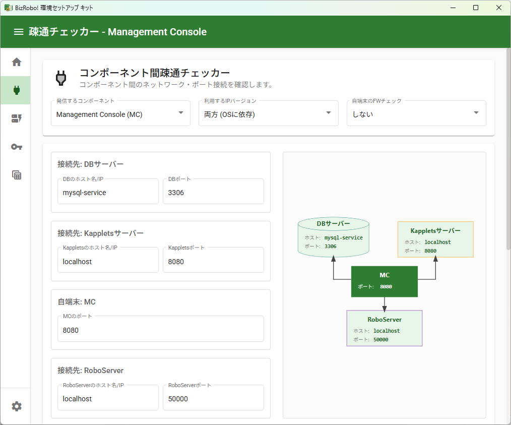
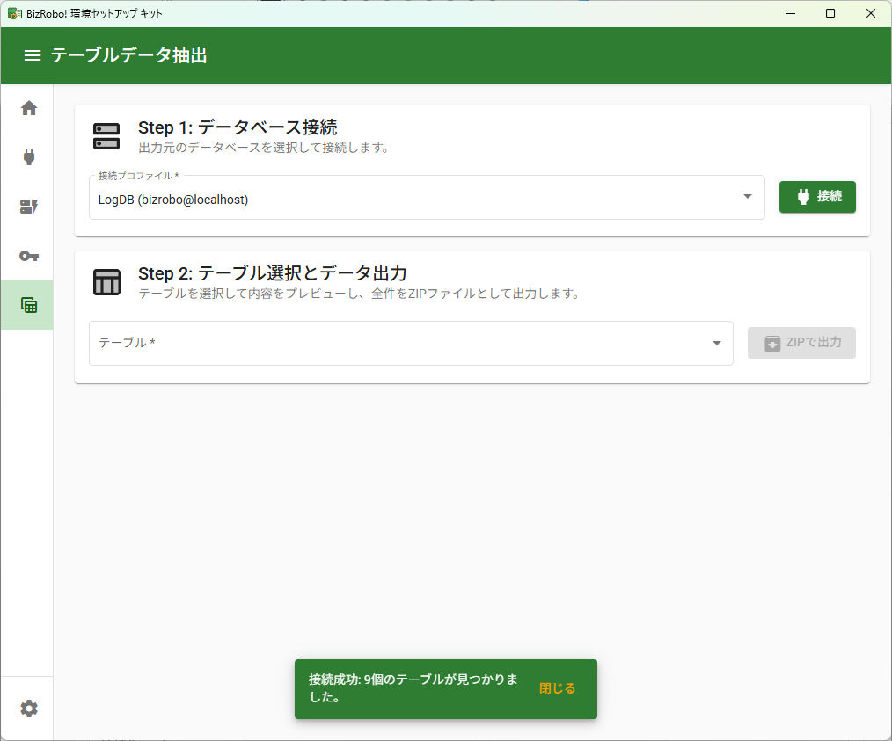

# BR! Setup Toolkit (BizRobo! 環境セットアップツールキット)

> BizRobo! 環境のセットアップと運用を支援するための非公式（Unofficial）なツールキットです。

BizRobo! の運用環境構築や、トラブルシューティングをスムーズに進めるために設計された、Electron ベースの多機能デスクトップアプリケーションです。
環境設定ファイルの生成、ネットワーク疎通確認、システム要件チェックなど、セットアップ作業で頻出するタスクを直感的な UI で実行できます。

---

## ✨ 主な機能

本ツールキットは、以下の独立した機能を提供します。

| 機能名                                | 概要                                                                                                                                                                                                                                                             |
| :------------------------------------ | :--------------------------------------------------------------------------------------------------------------------------------------------------------------------------------------------------------------------------------------------------------------- |
| **🏠 ホーム**                         | 各機能へアクセスするためのダッシュボード画面です。                                                                                                                                                                                                               |
| **🔌 コンポーネント間疎通チェッカー** | `ping`, `TCP接続`, `netstat` を利用して、BizRobo! の各コンポーネント間のネットワーク接続やポートの疎通状態を詳細にテストします。自端末のファイアウォール設定（Inbound/Outbound）の簡易チェックも可能です。                                                       |
| **✅ システム要件チェッカー**         | PowerShell スクリプトを実行し、BizRobo! の動作に必要となるミドルウェア（OpenJDK, Tomcat, MySQL など）やブラウザのバージョンが、指定した要件を満たしているかを自動でスキャン・判定します。                                                                        |
| **📝 バックアップファイル編集ツール** | Management Console からエクスポートした ZIP 形式のバックアップファイルを解析し、クラスター設定（Production ↔ Non Production）を切り替えた新しい ZIP ファイルを生成します。                                                                                       |
| **🛠️ セットアップユーティリティ**     | **設定ファイル生成**: `mc.xml` や `kapplets.xml` を対話形式で生成します。 **パスワード生成**: DB 接続などに使用できる、強力でランダムなパスワードを生成します。 **ランダム文字列生成**: `cluster.keystore.file` プロパティ用の 16 桁の英数字を生成します。 |
| **🔑 ライセンス認証ブラウザー**       | 隔離されたプライベートセッションを持つ組み込みブラウザを起動し、BizRobo! のライセンス認証を安全に行います。Cookie やキャッシュはウィンドウを閉じると破棄されます。                                                                                               |
| **📊 テーブルデータ抽出**             | データベースに接続し、指定したテーブルの全データを CSV 形式でエクスポート（ZIP 圧縮）します。大量データの抽出もストリーミング処理によりメモリ効率良く行います。                                                                                                  |
| **⚙️ アプリケーション設定**           | 「テーブルデータ抽出」機能で使用するデータベース接続情報を複数プロファイルとして管理します。パスワードは OS の機能を利用して安全に暗号化・保存されます。                                                                                                         |

---

## 🚀 ダウンロードとインストール

最新版のアプリケーションは、以下のリリースページからダウンロードしてください。

**➡️ [最新バージョンのダウンロードはこちら](https://github.com/1010-junji/BR.Setup.ToolKit/releases/latest)**

ご自身の環境に合わせて、2種類のファイルから選択してください。

*   **インストーラー版 (`BR-Setup-Toolkit-Setup-x.x.x.exe`)**
    *   PCにアプリケーションをインストールします。
    *   スタートメニューやデスクトップにショートカットが作成されます。
    *   **通常はこちらの利用を推奨します。**

*   **ポータブル版 (`BR-Setup-Toolkit-x.x.x.exe`)**
    *   インストール不要で、実行ファイル単体で動作します。
    *   USBメモリなどに入れて持ち運ぶ場合に便利です。

---

## 📖 使い方

### 🔌 コンポーネント間疎通チェッカー

この機能は、BizRobo! を構成する各コンポーネント間のネットワーク接続をテストします。

1.  **発信するコンポーネント**: チェックの起点となるコンポーネント（例: `Management Console (MC)`) をドロップダウンから選択します。
2.  **利用する IP バージョン**: テストに使用する IP プロトコル（IPv4/IPv6/両方）を選択します。
3.  **自端末の FW チェック**: `する` を選択すると、コンポーネント間疎通テストの前に、入力されたポート番号に対して自端末のファイアウォールが通信を許可しているか（Inbound/Outbound）を簡易的にテストします。
4.  **情報入力**: 選択したコンポーネントに応じて、接続先ホスト名やポート番号を入力します。入力内容は右側のアーキテクチャ図にリアルタイムで反映されます。
5.  **チェック実行**: ボタンをクリックすると、`ping`による疎通確認と TCP ポート接続テストが順次実行され、結果がログエリアに表示されます。
6.  **結果をファイルに出力**: テスト結果をタイムスタンプ付きのテキストファイルとして保存できます。

    

### ✅ システム要件チェッカー

ローカルマシンにインストールされている BizRobo! 関連のミドルウェアのバージョンをスキャンします。

1.  **対象とする BizRobo! バージョン**: チェックの基準となる BizRobo! のバージョン（例: `11.5`）をプリセットから選択します。選択すると、各ミドルウェアの要求バージョンが自動で入力されます。
2.  **要求バージョンのカスタマイズ**: 必要に応じて、各ソフトウェアの要求バージョンを個別に手入力で変更できます。
3.  **チェック実行**: ボタンをクリックすると、内部で PowerShell スクリプトが実行され、システム内のソフトウェア情報を収集・分析します。
4.  **結果確認**: 結果がテーブル形式で表示され、各項目が要求バージョンを満たしているかどうかが `OK` / `NG` アイコンで示されます。
5.  **結果をファイルに出力**: スキャン結果をテキストファイルとして保存できます。

> **Note:** この機能は Windows 環境でのみ動作し、PowerShell 3.0 以上が必要です。

### 📝 バックアップファイル編集ツール

Management Console のバックアップ ZIP ファイル内のクラスター情報を一括で切り替えます。

1.  **ファイルを選択**: 編集したい `*.zip` 形式のバックアップファイルを選択します。
2.  **処理を実行**: ボタンをクリックすると、ツールが ZIP ファイルを一時フォルダに展開し、`global.xml` および各 `project.xml` 内のクラスター名を `Production` と `Non Production` の間で相互に切り替えます。
3.  **結果確認**: 処理ログが表示され、成功すると `switched_元のファイル名.zip` という名前の新しいファイルが元のファイルと同じ場所に生成されます。

### 🛠️ セットアップユーティリティ

タブ形式で 3 つの小さな便利ツールを提供します。

- **設定ファイル生成**: `mc.xml` または `kapplets.xml` を選択し、DB 接続情報やバージョンを入力すると、対応する XML 設定ファイルの内容が生成されます。生成された内容はファイルとして直接保存できます。
- **パスワード生成**: 長さや使用する文字種（大文字、小文字、数字、記号）を指定して、安全なパスワードを生成します。
- **ランダム文字列生成**: `cluster.keystore.file` プロパティで必要となる 16 桁のランダムな英数字をワンクリックで生成します。

### 🔑 ライセンス認証ブラウザー

外部ブラウザが利用できない環境で、MC にアクセスしてライセンス認証を行うための機能です。

1.  **MC の URL を入力**: Management Console の URL（例: `http://localhost:50080`）を入力します。
2.  **ウィンドウで開く**: ボタンをクリックすると、完全に独立したセッションを持つ新しいウィンドウで MC が開きます。このウィンドウは Cookie やキャッシュを一切保存せず、Windows 統合認証も無効化されているため、毎回クリーンな状態でログインできます。

   
### 📊 テーブルデータ抽出

データベースに直接接続し、テーブルデータを抽出します。

1.  **接続プロファイルを選択**: 「アプリケーション設定」画面で登録した DB 接続プロファイルを選択します。
2.  **接続**: ボタンをクリックしてデータベースに接続します。成功すると、そのデータベース内のテーブル一覧がドロップダウンに表示されます。
3.  **テーブルを選択**: データを抽出したいテーブルを選択します。選択すると、テーブルの先頭 100 件がプレビューとして画面に表示されます。
4.  **ZIP で出力**: ボタンをクリックすると、選択したテーブルの **全件データ** が CSV 形式で ZIP ファイルに圧縮され、保存ダイアログが表示されます。

    

### ⚙️ アプリケーション設定

「テーブルデータ抽出」機能で使用する DB 接続プロファイルを管理します。

- **一覧**: 保存されている接続設定がリスト表示されます。
- **新規追加**: `+` ボタンから新しい接続設定を追加できます。
- **編集・削除**: リストから設定を選択すると、右側のフォームで内容を編集・保存できます。削除ボタンで設定を削除することも可能です。
- **接続テスト**: 入力した情報でデータベースに正しく接続できるかをテストできます。

---

## セキュリティに関する考察

このアプリケーションは、システム情報へのアクセスや外部リソースへの接続を伴うため、以下のセキュリティ対策を講じています。

- **DB パスワードの暗号化**:
  「アプリケーション設定」で保存されるデータベースのパスワードは、平文では保存されません。Electron の `safeStorage` モジュールを利用し、OS の暗号化機能（Windows の DPAPI など）を使って暗号化された上で設定ファイルに保存されます。これにより、設定ファイルを直接読み取られてもパスワードが漏洩するリスクを低減しています。

- **PowerShell スクリプトの実行**:
  「システム要件チェッカー」は、ローカルのソフトウェア情報を取得するために、アプリケーションに同梱された署名なしの PowerShell スクリプトを実行します。実行時には `-ExecutionPolicy Bypass` フラグが使用されますが、実行されるスクリプトはプロジェクト内に固定的に含まれるものに限定されており、外部から任意のスクリプトを読み込む機能はありません。スクリプトの内容は `server/assets` ディレクトリで確認できます。

- **隔離されたブラウザセッション**:
  「ライセンス認証ブラウザー」は、`partition` オプションを使用して、通常の Electron セッションや OS のブラウザとは完全に隔離されたセッションで動作します。これにより、Cookie、キャッシュ、履歴などが他のセッションと共有されることはなく、ウィンドウを閉じると全てのセッションデータが破棄されます。

- **証明書エラーのハンドリング**:
  `localhost` または `127.0.0.1` への接続で発生した自己署名証明書などのエラーは、開発環境の利便性を考慮して自動的に許可されます。それ以外の外部ドメインに対する証明書エラーは通常通りブロックされます。

- **Windows 統合認証の無効化**:
  「ライセンス認証ブラウザー」では、Active Directory 環境下などで発生するブラウザの自動ログイン（NTLM 認証など）を意図的に無効化しています。これにより、ウィンドウを開くたびに必ず手動でのログインが要求され、意図しないアカウントでの認証を防ぎます。

---

## 💻 動作環境

*   **Windows 10 (64bit)**
*   **Windows 11 (64bit)**
*   **Windows Server 2016 / 2019 / 2022**

※ 上記以外の環境では動作を保証しません。

---

## ⚠️ 注意事項・免責事項

*   本ツールは有志によって作成・公開されている **非公式(Unofficial)のツール** であり、OPEN株式会社、およびBizRobo! パートナー各社が公式にサポートするソフトウェアではありません。
*   本ツールの使用ににおいては **必ず利用者ご自身の責任においてご利用ください。**
