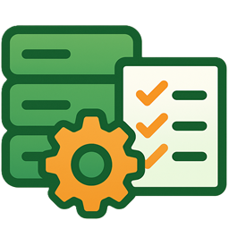

# BR! Setup Toolkit (BizRobo! 環境セットアップツールキット)

> BizRobo! 環境のセットアップと運用を支援するための非公式（Unofficial）なツールキットです。

このツールは、BizRobo! の導入や運用保守の現場で頻繁に発生する、煩雑な確認作業や定型作業を効率化することを目的としています。

---

## ✨ 主な機能

このツールキットには、以下の機能が含まれています。

| アイコン | 機能名 | 説明 |
| :---: | :--- | :--- |
| 🔌 | **コンポーネント間疎通チェッカー** | MC, RS, DAS, Kapplets, DBサーバー間のネットワーク接続（Ping/TCPポート）を確認します。GUIからパラメータを入力するだけで、ファイアウォールの設定ミスや名前解決の問題を迅速に切り分けられます。 |
| 🗂️ | **バックアップファイル編集ツール** | Management Consoleからエクスポートしたバックアップファイル（ZIP）内のクラスター情報（Production/Non-Production）を一括で切り替えます。環境移行時の設定変更作業を自動化します。 |
| 🔑 | **ライセンス認証ブラウザー** | Windows Server等のブラウザが制限された環境でも、プライベートなブラウザウィンドウでManagement Consoleを開き、ライセンス認証を行うことができます。 |
| 🛢️ | **テーブルデータ抽出** | データベースに接続し、指定したテーブルの全件データをCSV形式でエクスポートし、ZIPファイルとして保存します。障害調査やデータ移行時の作業を簡略化します。 |
| ⚙️ | **アプリケーション設定** | 「テーブルデータ抽出」機能で使用するデータベース接続情報を複数プロファイルとして管理できます。 |

---

## 🚀 ダウンロードとインストール

最新版のアプリケーションは、以下のリリースページからダウンロードしてください。

**➡️ [最新バージョンのダウンロードはこちら](https://github.com/1010-junji/BR.Setup.ToolKit/releases/latest)**

ご自身の環境に合わせて、2種類のファイルから選択してください。

*   **インストーラー版 (`BR-Setup-Toolkit-Setup-x.x.x.exe`)**
    *   PCにアプリケーションをインストールします。
    *   スタートメニューやデスクトップにショートカットが作成されます。
    *   **通常はこちらの利用を推奨します。**

*   **ポータブル版 (`BR-Setup-Toolkit-x.x.x.exe`)**
    *   インストール不要で、実行ファイル単体で動作します。
    *   USBメモリなどに入れて持ち運ぶ場合に便利です。

---

## 📖 使い方

### 1. 疎通チェッカー

1.  サイドメニューから「コンポーネント間疎通チェッカー」を選択します。
2.  **「発信するコンポーネント」** で、チェックの起点となるコンポーネント（例: Management Console）を選択します。
3.  表示されたフォームに、接続先のホスト名やポート番号を入力します。
4.  （オプション） **「自端末のFWチェック」** を「する」にすると、入力されたポート番号に対して自端末のファイアウォールが通信を許可しているか（Inbound/Outbound）をチェックします。
5.  「チェック実行」ボタンをクリックすると、下部のログエリアに結果がリアルタイムで表示されます。

### 2. バックアップファイル編集ツール

1.  サイドメニューから「バックアップファイル編集ツール」を選択します。
2.  「ファイルを選択...」ボタンをクリックし、編集したいManagement ConsoleのバックアップZIPファイルを選択します。
3.  「処理を実行」ボタンをクリックします。
4.  処理が完了すると、元のファイルと同じ場所に `switched_元のファイル名.zip` という名前で、クラスター情報が切り替わった新しいZIPファイルが生成されます。

### 3. ライセンス認証ブラウザー

1.  サイドメニューから「ライセンス認証ブラウザー」を選択します。
2.  ライセンスを登録したいManagement ConsoleのURL（例: `http://localhost:50080`）を入力します。
3.  「ウィンドウで開く」ボタンをクリックすると、新しいプライベートウィンドウでMCの画面が表示されます。
    *   このウィンドウはCookieやキャッシュを保存せず、Windows統合認証も無効化されているため、常にクリーンな状態でログイン・操作が可能です。

### 4. テーブルデータ抽出

この機能を使用するには、**最初に接続先のデータベース情報を設定する必要があります。**

**【初回設定】**
1.  サイドメニューから「アプリケーション設定」（歯車アイコン）を選択します。
2.  「+」ボタンをクリックして新しい設定フォームを表示します。
3.  設定名、ホスト名、ユーザー名、パスワードなどのデータベース接続情報を入力し、「保存」ボタンをクリックします。
4.  「接続テスト」ボタンで、入力した情報が正しいかを確認できます。

**【データ抽出】**
1.  サイドメニューから「テーブルデータ抽出」を選択します。
2.  「接続プロファイル」ドロップダウンから、先ほど設定したデータベースを選択し、「接続」ボタンをクリックします。
3.  接続に成功すると、テーブル一覧がドロップダウンに表示されます。
4.  出力したいテーブルを選択すると、下部にデータのプレビュー（先頭100件）が表示されます。
5.  「ZIPで出力」ボタンをクリックすると、テーブルの全件データを含むCSVファイルを格納したZIPファイルが保存されます。

---

## 💻 動作環境

*   **Windows 10 (64bit)**
*   **Windows 11 (64bit)**
*   **Windows Server 2016 / 2019 / 2022**

※ 上記以外の環境では動作を保証しません。

---

## ⚠️ 注意事項・免責事項

*   **本ツールは非公式(Unofficial)ツールです。** OPEN株式会社、およびBizRobo! パートナー各社による公式なサポートはありません。本ツールに関するお問い合わせはご遠慮ください。
*   本ツールの使用によって生じたいかなる損害についても、作成者は一切の責任を負いません。**必ずご自身の責任においてご利用ください。**
*   特に、データベースへの接続やファイルの編集を行う機能については、事前にテスト環境で十分に動作を検証し、データのバックアップを取得した上でご利用いただくことを強く推奨します。

---

## 📄 ライセンス

このアプリケーションは **Apache-2.0 License** の下で公開されています。
